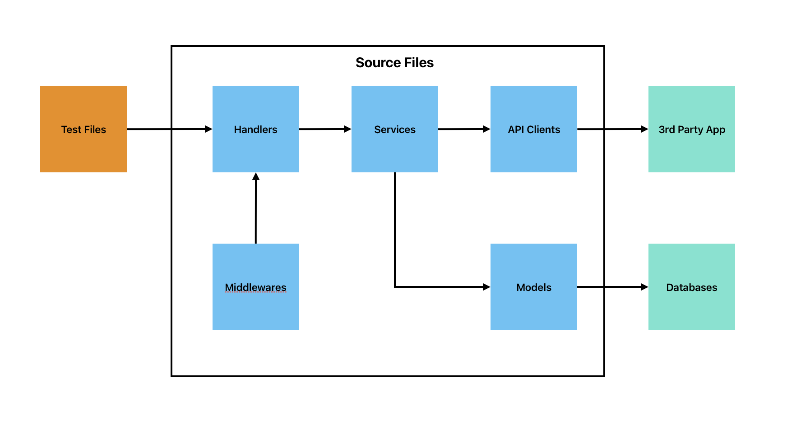
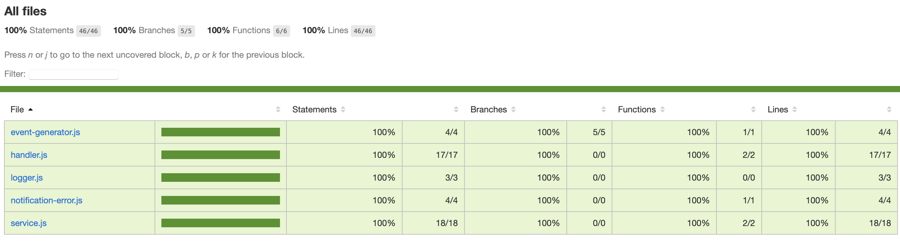
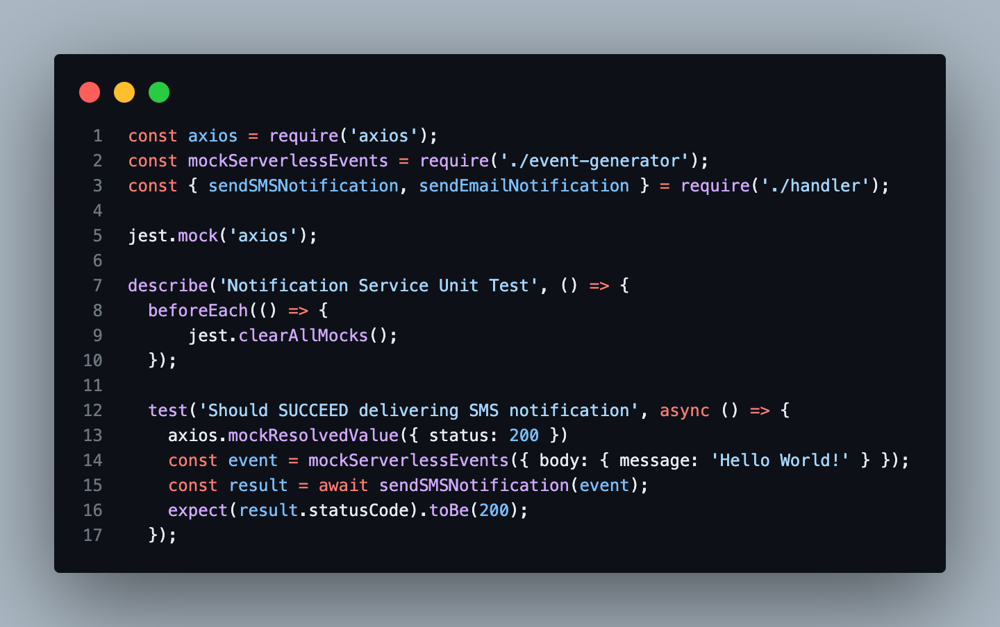

# serverless-unit-test-boilerplate
This repository is created to help beginners understand the basic, fast and easy way to cover almost 100% of unit test coverage using the serverless framework.

## System Architecture

## Test Coverage Result

## General Idea
In order to maximize the coverage of unit testing and prevent messy test files, simply **target only the handler files** by mocking a serverless event. From there you will be able to generate a base concept of unit testing and it would be easier to create test cases such as middleware handling, error catching and lots of elements in the service (deeper) layer of your services.

## Steps to take
1. Clone and try the boilerplate to fully understand the steps in unit testing the handler layer. Make sure that you have a good understanding in serverless and jest library so it would be more easier to follow the instructions.

2. Create an **event generator** file wherein it mocks the https request in order to call your handlers properly.

3. Put your payload to the **event generator** and call the handler directly from the test file.

### Dealing with 3rd Party APIs
To prevent slow, delayed and possible runtime error in your CI/CD pipeline, make sure to mock every possible 3rd Part API call responses for each test cases based on the expected result you want to have.

From the image above, you will see that before the execution of this test file, axios is expected to return mock responses based on its configuration for each test cases.

This skip the unnecessary business logic and focuses only on the unit testing and making sure that the legacy code is working properly.